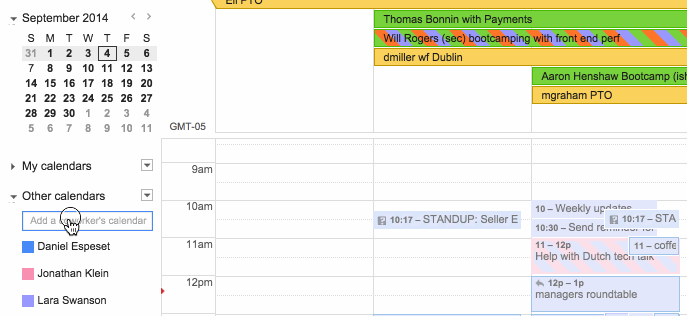

# Add and Remove Calendars #

Chrome extension that turns the "Add a coworker's calendar" field in Google Calendar™ into a toggle for adding AND removing calendars.  Also puts active calendars at the top.

